# 📚 Framework de RAG Híbrido - Documentação Técnica

Este documento descreve a arquitetura interna do framework de RAG híbrido, explicando cada componente, suas responsabilidades e como estender o sistema adicionando novos componentes.

---

## 🏗️ **Arquitetura Geral**

O framework segue uma arquitetura **modular baseada em interfaces (ABCs)**, onde cada componente tem uma responsabilidade única e bem definida. Isso permite:

- ✅ **Trocar componentes** sem reescrever código existente
- ✅ **Compor diferentes estratégias** facilmente
- ✅ **Testar componentes isoladamente**
- ✅ **Adicionar novas funcionalidades** sem quebrar código legado

### **Fluxo de Execução**

```mermaid
flowchart TD
    A[Query] --> B[Vectorizer<br/>Texto → Vetor]
    B --> C[Index<br/>Busca Rápida]
    C --> D[Retriever<br/>Orquestrador]
    D --> E[Fusion<br/>Combinar Modalidades]
    E --> F[Reranker<br/>Refinamento]
    F --> G[Final Results]
```



---

## 📦 **Componentes Principais**

### **0. Encoders** (`src/encoders/`)

Os encoders são blocos que transformam texto em vetores para uma modalidade específica. Normalmente você NÃO precisa mexer nesses arquivos para criar uma solução nova; eles existem para reuso pelos vectorizers.

- O que são: funções/objetos de texto → vetor por modalidade (semântico, lexical/TF‑IDF, entidades, APIs).
- Para que servem: prover as fatias básicas que os vectorizers combinam, escalonam e concatenam.
- Quando criar um encoder novo: apenas em casos avançados (ex.: usar um backend proprietário, uma API não suportada ou um tokenizador especial).

Encoders disponíveis:
- Semântico (Hugging Face): `HFSemanticEncoder` — embeddings via Sentence-Transformers/Transformers
- Semântico (OpenAI): `OpenAISemanticEncoder` — embeddings via API da OpenAI
- Lexical: `TfidfEncoder` — TF‑IDF com backend `sklearn` (ou analyzer do Pyserini)
- Entidades: `EntityEncoderReal` — extrai entidades (spaCy/sciSpaCy), calcula IDF e agrega com embeddings

Como adicionar um novo encoder (avançado):
1) Crie uma classe em `src/encoders/` com o método `encode_text(text: str, is_query: bool=False) -> np.ndarray` e, se necessário, métodos de preparação (ex.: `fit`).
2) Use esse encoder dentro de um vectorizer (veja seção Vectorizer abaixo), sem precisar mudar o restante do pipeline.

Exemplo mínimo de encoder customizado (esqueleto):

```python
# src/encoders/my_encoder.py
import numpy as np

class MyEncoder:
    def __init__(self, dim: int = 128, normalize: bool = True):
        self.dim = dim
        self.normalize = normalize

    def encode_text(self, text: str, is_query: bool = False) -> np.ndarray:
        v = np.random.randn(self.dim).astype(np.float32)  # substitua pela lógica real
        if self.normalize:
            n = np.linalg.norm(v) + 1e-12
            v = v / n
        return v
```

Depois, plugue esse encoder em um vectorizer customizado (sem alterar o resto do sistema).

### **1. Vectorizer** (`src/vectorizers/`)

**Responsabilidade**: Converter texto em representação vetorial (numérica).

#### **O que faz?**

O `Vectorizer` transforma texto bruto em vetores numéricos combinando e compondo encoders. Ele pode fazer fit no corpus (TF‑IDF/entidades), aplicar normalizações/escalas e concatenar fatias. Ele **não armazena** os vetores, apenas os cria.

Importante para desenvolvimento:
- Você pode usar SOMENTE encoders já existentes (sem tocar em `encoders/`) e criar um vectorizer novo em `src/vectorizers/` para compor as modalidades do jeito que quiser.
- Criar um encoder novo é opcional e só para casos avançados; na maioria dos cenários basta trocar `semantic.model` no YAML (para usar um BERT/HF diferente) ou combinar TF‑IDF/Entidades via vectorizer.

**Interface**: `AbstractVectorizer`

```python
class AbstractVectorizer(ABC):
    @abstractmethod
    def fit_corpus(self, docs_texts: Iterable[str]) -> None:
        """Treina o vectorizer no corpus (vocabulário, IDF, etc.)"""
    
    @abstractmethod
    def encode_text(self, text: str, is_query: bool = False) -> Dict[str, np.ndarray]:
        """Converte texto em vetor(es) - pode retornar múltiplas fatias"""
    
    @abstractmethod
    def concat(self, parts: Dict[str, np.ndarray]) -> np.ndarray:
        """Concatena e normaliza fatias em um único vetor"""
    
    @property
    @abstractmethod
    def total_dim(self) -> int:
        """Dimensão total do vetor concatenado"""
```

#### **Implementações Existentes**

1. **`DenseVectorizer`**: Apenas embeddings semânticos (ex: MiniLM, BGE-Large)
2. **`TFIDFVectorizer`**: Apenas representação lexical (TF-IDF sparse)
3. **`BiModalVectorizer`**: Combina semantic + TF-IDF
4. **`TriModalVectorizer`**: Combina semantic + TF-IDF + entities
5. **`GraphVectorizer`**: Apenas embeddings de entidades

#### **Exemplo de Uso**

```python
from src.vectorizers.tri_modal_vectorizer import TriModalVectorizer

vectorizer = TriModalVectorizer(
    semantic_model_name="sentence-transformers/all-MiniLM-L6-v2",
    tfidf_dim=1000,
    graph_model_name="BAAI/bge-large-en-v1.5",
)

# 1. Treinar no corpus
vectorizer.fit_corpus(["Documento 1...", "Documento 2..."])

# 2. Vetorizar query
query_parts = vectorizer.encode_text("What is machine learning?", is_query=True)
# Retorna: {"s": array([...]), "t": array([...]), "g": array([...])}

# 3. Concatenar
query_vec = vectorizer.concat(query_parts)  # array([2408d])
```

#### **Como Adicionar um Novo Vectorizer**

**Passo 1**: Criar classe que implementa `AbstractVectorizer`

```python
# src/vectorizers/my_custom_vectorizer.py

from typing import Dict, Iterable
import numpy as np
from ..core.interfaces import AbstractVectorizer

class MyCustomVectorizer(AbstractVectorizer):
    """Exemplo: Vectorizer que combina BERT + BM25"""
    
    def __init__(self, bert_model: str = "bert-base-uncased"):
        self.bert_model = bert_model
        self.bert_encoder = None  # Inicializar aqui
        self.bm25 = None
        self.fitted = False
        self.slice_dims = {}
    
    def fit_corpus(self, docs_texts: Iterable[str]) -> None:
        """Treina BM25 e prepara BERT"""
        docs_list = list(docs_texts)
        
        # Treinar BM25
        from rank_bm25 import BM25Okapi
        tokenized = [doc.split() for doc in docs_list]
        self.bm25 = BM25Okapi(tokenized)
        
        # Carregar BERT (exemplo)
        # self.bert_encoder = AutoModel.from_pretrained(self.bert_model)
        
        self.slice_dims = {"bert": 768, "bm25": len(self.bm25.idf)}
        self.fitted = True
    
    def encode_text(self, text: str, is_query: bool = False) -> Dict[str, np.ndarray]:
        """Retorna fatias separadas"""
        assert self.fitted, "Chame fit_corpus() primeiro"
        
        # BERT embedding
        bert_vec = self._encode_bert(text)  # [768d]
        
        # BM25 scores (normalizados)
        bm25_vec = self._encode_bm25(text)  # [vocab_size]
        
        return {"bert": bert_vec, "bm25": bm25_vec}
    
    def concat(self, parts: Dict[str, np.ndarray]) -> np.ndarray:
        """Concatena e normaliza"""
        vec = np.concatenate([parts["bert"], parts["bm25"]])
        return vec / (np.linalg.norm(vec) + 1e-8)  # L2 normalize
    
    @property
    def total_dim(self) -> int:
        return self.slice_dims.get("bert", 0) + self.slice_dims.get("bm25", 0)
    
    def _encode_bert(self, text: str) -> np.ndarray:
        # Implementação real do BERT
        pass
    
    def _encode_bm25(self, text: str) -> np.ndarray:
        # Implementação real do BM25
        pass
```

**Passo 2**: Registrar na factory

```python
# src/vectorizers/factory.py

from .my_custom_vectorizer import MyCustomVectorizer

def create_vectorizer(config: Dict[str, Any]) -> AbstractVectorizer:
    vec_type = config.get("type", "tri_modal").lower()
    
    # ... código existente ...
    
    elif vec_type == "my_custom":
        return MyCustomVectorizer(
            bert_model=config.get("bert_model", "bert-base-uncased"),
        )
    
    else:
        raise ValueError(f"Unknown vectorizer type: {vec_type}")
```

**Passo 3**: Atualizar schema de configuração

```python
# src/config/schema.py

class VectorizerConfig(BaseModel):
    type: Literal["dense", "tfidf", "bi_modal", "tri_modal", "graph", "my_custom"] = "tri_modal"
    # ... outros campos ...
```

**Passo 4**: Usar em YAML

```yaml
retrievers:
  - type: "hybrid"
    vectorizer:
      type: "my_custom"
      bert_model: "bert-base-uncased"
```

---

### **2. Index** (`src/indexes/`)

**Responsabilidade**: Armazenar vetores e realizar busca eficiente por similaridade.

#### **O que faz?**

O `Index` recebe vetores já criados pelo `Vectorizer` e os organiza em uma estrutura otimizada para busca rápida. Ele **não sabe** como criar vetores, apenas os armazena e busca.

**Interface**: `AbstractIndex`

```python
class AbstractIndex(ABC):
    @abstractmethod
    def build(self, doc_id_and_text: Iterable[Tuple[str, str]]) -> None:
        """Constrói o índice a partir de documentos (vetoriza internamente)"""
    
    @abstractmethod
    def search(self, query_vec: np.ndarray, topk: int = 10) -> List[Tuple[str, float]]:
        """Busca top-K vetores mais similares ao query_vec"""
```

#### **Implementações Existentes**

1. **`FaissFlatIPIndex`**: Busca exata usando FAISS IndexFlatIP (inner product)
2. **`HybridIndex`**: Índice FAISS avançado com suporte a:
   - IndexFlatIP (busca exata)
   - IndexFactory (IVF, PQ, OPQ para busca aproximada)
   - GPU acceleration
   - Persistência (salvar/carregar)

#### **Exemplo de Uso**

```python
from src.indexes.hybrid_index import HybridIndex
from src.vectorizers.tri_modal_vectorizer import TriModalVectorizer

vectorizer = TriModalVectorizer(...)
vectorizer.fit_corpus(docs_texts)

index = HybridIndex(
    vectorizer=vectorizer,
    faiss_factory=None,  # IndexFlatIP (exato)
    faiss_metric="ip",   # Inner Product
    artifact_dir="./artifacts",
)

# Construir índice
index.build([(doc_id, doc_text) for doc_id, doc_text in docs])

# Buscar
query_vec = vectorizer.concat(vectorizer.encode_text("query text", is_query=True))
results = index.search(query_vec, topk=10)
# Retorna: [("doc_1", 0.95), ("doc_2", 0.87), ...]
```

#### **Como Adicionar um Novo Index**

**Passo 1**: Criar classe que implementa `AbstractIndex`

```python
# src/indexes/annoy_index.py

from typing import List, Tuple, Iterable
import numpy as np
from annoy import AnnoyIndex
from ..core.interfaces import AbstractIndex, AbstractVectorizer

class AnnoyIndexWrapper(AbstractIndex):
    """Wrapper para Annoy (biblioteca de busca aproximada)"""
    
    def __init__(
        self,
        vectorizer: AbstractVectorizer,
        n_trees: int = 10,
        metric: str = "angular",  # "angular" ou "euclidean"
        artifact_dir: Optional[str] = None,
    ):
        self.vec = vectorizer
        self.n_trees = n_trees
        self.metric = metric
        self.artifact_dir = Path(artifact_dir) if artifact_dir else None
        self.index = None
        self.doc_ids: List[str] = []
        self.dimension = 0
    
    def build(self, doc_id_and_text: Iterable[Tuple[str, str]]) -> None:
        """Constrói índice Annoy"""
        doc_list = list(doc_id_and_text)
        
        # Vetorizar documentos
        vectors = []
        for doc_id, text in doc_list:
            parts = self.vec.encode_text(text, is_query=False)
            vec = self.vec.concat(parts)
            vectors.append(vec)
            self.doc_ids.append(doc_id)
        
        if not vectors:
            return
        
        # Criar índice Annoy
        self.dimension = len(vectors[0])
        metric_type = AnnoyIndex.ANGULAR if self.metric == "angular" else AnnoyIndex.EUCLIDEAN
        self.index = AnnoyIndex(self.dimension, metric_type)
        
        for i, vec in enumerate(vectors):
            self.index.add_item(i, vec)
        
        # Construir árvores
        self.index.build(self.n_trees)
        
        # Salvar se artifact_dir especificado
        if self.artifact_dir:
            self._save()
    
    def search(self, query_vec: np.ndarray, topk: int = 10) -> List[Tuple[str, float]]:
        """Busca top-K"""
        if self.index is None:
            return []
        
        # Annoy retorna (indices, distances)
        indices, distances = self.index.get_nns_by_vector(
            query_vec.tolist(),
            topk,
            include_distances=True
        )
        
        # Converter distâncias em scores (Annoy retorna distâncias, não similaridades)
        # Para angular: score = 1 - distance (quanto menor distância, maior similaridade)
        scores = [1.0 - d for d in distances] if self.metric == "angular" else distances
        
        return [(self.doc_ids[i], float(score)) for i, score in zip(indices, scores)]
    
    def _save(self):
        """Salva índice em disco"""
        if self.artifact_dir and self.index:
            index_path = self.artifact_dir / "annoy.index"
            self.index.save(str(index_path))
            
            # Salvar doc_ids
            ids_path = self.artifact_dir / "annoy.ids.json"
            with open(ids_path, "w") as f:
                json.dump(self.doc_ids, f)
```

**Passo 2**: Registrar na factory

```python
# src/indexes/factory.py

from .annoy_index import AnnoyIndexWrapper

def create_index(config: Dict[str, Any], vectorizer: AbstractVectorizer) -> AbstractIndex:
    index_type = config.get("type", "faiss").lower()
    
    # ... código existente ...
    
    elif index_type == "annoy":
        return AnnoyIndexWrapper(
            vectorizer=vectorizer,
            n_trees=config.get("n_trees", 10),
            metric=config.get("metric", "angular"),
            artifact_dir=config.get("artifact_dir"),
        )
```

**Passo 3**: Atualizar schema

```python
# src/config/schema.py

class IndexConfig(BaseModel):
    type: Literal["faiss", "numpy", "annoy"] = "faiss"
    # ... outros campos ...
```

---

### **3. Retriever** (`src/retrievers/`)

**Responsabilidade**: Orquestrar o pipeline completo de retrieval (vectorizer → index → fusion → reranker).

#### **O que faz?**

O `Retriever` é o **coordenador** que:
1. Usa o `Vectorizer` para criar vetores
2. Usa o `Index` para buscar candidatos
3. Usa `Fusion` para combinar resultados (se múltiplas modalidades)
4. Usa `Reranker` para refinar ranking final

**Interface**: `AbstractRetriever`

```python
class AbstractRetriever(ABC):
    @abstractmethod
    def build_index(self, docs: List[Document]) -> None:
        """Constrói índice a partir de documentos"""
    
    @abstractmethod
    def retrieve(self, queries: List[Query], k: int = 10) -> Dict[str, List[Tuple[str, float]]]:
        """Retorna top-K documentos para cada query"""
```

#### **Implementações Existentes**

1. **`DenseFaiss`**: Retriever apenas com embeddings densos
2. **`TFIDFRetriever`**: Retriever apenas com TF-IDF
3. **`GraphRetriever`**: Retriever apenas com embeddings de entidades
4. **`BM25Basic`**: Retriever BM25 (lexical)
5. **`HybridRetriever`**: Retriever tri-modal com reranking
6. **`DATHybridRetriever`**: Retriever híbrido com DAT (Dynamic Alpha Tuning)
7. **`BaselineHybridRetriever`**: Retriever híbrido com alpha fixo

#### **Exemplo de Uso**

```python
from src.retrievers.hybrid_faiss import HybridRetriever
from src.vectorizers.tri_modal_vectorizer import TriModalVectorizer
from src.indexes.hybrid_index import HybridIndex
from src.fusion.reranker import TriModalReranker
from src.fusion.weighting import HeuristicLLMPolicy

# Criar componentes
vectorizer = TriModalVectorizer(...)
index = HybridIndex(vectorizer=vectorizer, ...)
reranker = TriModalReranker(vectorizer)
policy = HeuristicLLMPolicy()

# Criar retriever
retriever = HybridRetriever(
    vectorizer=vectorizer,
    index=index,
    reranker=reranker,
    weight_policy=policy,
    topk_first=150,
)

# Construir índice
retriever.build_index(documents)

# Buscar
results = retriever.retrieve(queries, k=10)
# Retorna: {"query_1": [("doc_1", 0.95), ...], "query_2": [...]}
```

#### **Como Adicionar um Novo Retriever**

**Passo 1**: Criar classe que implementa `AbstractRetriever`

```python
# src/retrievers/colbert_retriever.py

from typing import Dict, List, Tuple
from ..core.interfaces import AbstractRetriever
from ..datasets.schema import Document, Query

class ColBERTRetriever(AbstractRetriever):
    """Retriever usando ColBERT (contextualized late interaction)"""
    
    def __init__(self, model_name: str = "colbert-ir/colbertv2.0"):
        self.model_name = model_name
        self.colbert_model = None  # Carregar modelo ColBERT
        self.doc_embeddings = {}  # doc_id -> tensor
        self.fitted = False
    
    def build_index(self, docs: List[Document]) -> None:
        """Indexa documentos usando ColBERT"""
        from colbert import Indexer
        
        # ColBERT cria embeddings token-level (não document-level)
        indexer = Indexer(checkpoint=self.model_name)
        
        # Indexar documentos
        for doc in docs:
            doc_text = f"{doc.title} {doc.text}"
            # ColBERT retorna tensor [num_tokens, dim]
            doc_emb = self.colbert_model.encode(doc_text)
            self.doc_embeddings[doc.doc_id] = doc_emb
        
        self.fitted = True
    
    def retrieve(self, queries: List[Query], k: int = 10) -> Dict[str, List[Tuple[str, float]]]:
        """Busca usando MaxSim (late interaction)"""
        results = {}
        
        for query in queries:
            # Encode query
            query_emb = self.colbert_model.encode(query.text)  # [num_tokens, dim]
            
            # Calcular MaxSim scores
            scores = []
            for doc_id, doc_emb in self.doc_embeddings.items():
                # MaxSim: max sobre tokens da query, soma sobre tokens do doc
                # score = sum(max(query_token · doc_token))
                maxsim = self._maxsim(query_emb, doc_emb)
                scores.append((doc_id, maxsim))
            
            # Ordenar e retornar top-K
            scores.sort(key=lambda x: x[1], reverse=True)
            results[query.query_id] = scores[:k]
        
        return results
    
    def _maxsim(self, query_emb, doc_emb):
        """Calcula MaxSim score"""
        # Implementação real do MaxSim
        pass
```

**Passo 2**: Registrar na factory

```python
# src/retrievers/factory.py

from .colbert_retriever import ColBERTRetriever

def create_retriever(config: Dict[str, Any]) -> AbstractRetriever:
    retriever_type = config.get("type", "hybrid").lower()
    
    # ... código existente ...
    
    elif retriever_type == "colbert":
        return ColBERTRetriever(
            model_name=config.get("model", "colbert-ir/colbertv2.0"),
        )
    
    else:
        raise ValueError(f"Unknown retriever type: {retriever_type}")
```

**Passo 3**: Atualizar schema

```python
# src/config/schema.py

class RetrieverConfig(BaseModel):
    type: Literal["hybrid", "dense", "tfidf", "graph", "bm25", "dat_hybrid", "baseline_hybrid", "colbert"] = "hybrid"
    # ... outros campos ...
```

---

### **4. Fusion** (`src/fusion/`)

**Responsabilidade**: Combinar resultados de múltiplas modalidades ou múltiplos retrievers.

#### **4.1. Fusion Strategy** (`src/fusion/strategies.py`)

**O que faz?** Combina listas ranqueadas de diferentes métodos em uma única lista.

**Interface**: `AbstractFusionStrategy`

```python
class AbstractFusionStrategy(ABC):
    @abstractmethod
    def fuse(
        self,
        query: str,
        results_list: List[Dict[str, List[Tuple[str, float]]]],
        weights: Optional[List[float]] = None,
    ) -> List[Tuple[str, float]]:
        """Combina múltiplas listas ranqueadas em uma única"""
```

**Implementações Existentes**:
- `WeightedCosineFusion`: Soma ponderada de scores
- `ReciprocalRankFusion`: RRF (Reciprocal Rank Fusion)
- `DATLinearFusion`: Combinação linear com alpha adaptativo

#### **Como Adicionar Nova Estratégia de Fusão**

```python
# src/fusion/strategies.py

class BordaCountFusion(AbstractFusionStrategy):
    """Borda Count: soma posições inversas"""
    
    def fuse(
        self,
        query: str,
        results_list: List[Dict[str, List[Tuple[str, float]]]],
        weights: Optional[List[float]] = None,
    ) -> List[Tuple[str, float]]:
        if not results_list:
            return []
        
        if weights is None:
            weights = [1.0] * len(results_list)
        
        # Borda Count: score = soma de (n - rank + 1) para cada lista
        doc_scores: Dict[str, float] = {}
        n = max(len(r[next(iter(r.keys()))]) for r in results_list if r)
        
        for result_dict, weight in zip(results_list, weights):
            query_id = next(iter(result_dict.keys()))
            for rank, (doc_id, _) in enumerate(result_dict[query_id], start=1):
                borda_score = (n - rank + 1) * weight
                doc_scores[doc_id] = doc_scores.get(doc_id, 0.0) + borda_score
        
        return sorted(doc_scores.items(), key=lambda x: x[1], reverse=True)

# Registrar
FUSION_STRATEGIES["borda_count"] = BordaCountFusion
```

#### **4.2. Weight Policy** (`src/fusion/weighting.py`)

**O que faz?** Determina pesos para cada modalidade baseado na query.

**Interface**: `AbstractWeightPolicy`

```python
class AbstractWeightPolicy(ABC):
    @abstractmethod
    def weights(self, query_text: str) -> Tuple[float, ...]:
        """Retorna pesos para cada modalidade"""
```

**Implementações Existentes**:
- `StaticPolicy`: Pesos fixos
- `HeuristicLLMPolicy`: Pesos adaptativos baseados em heurísticas
- `DATWeightPolicy`: Pesos baseados em LLM judge (DAT)

#### **Como Adicionar Nova Weight Policy**

```python
# src/fusion/weighting.py

class QueryLengthPolicy(AbstractWeightPolicy):
    """Ajusta pesos baseado no comprimento da query"""
    
    def weights(self, query_text: str) -> Tuple[float, ...]:
        query_len = len(query_text.split())
        
        if query_len <= 3:
            # Query curta: mais peso em TF-IDF (exato matching)
            return (0.3, 0.5, 0.2)  # (semantic, tfidf, graph)
        elif query_len <= 10:
            # Query média: balanceado
            return (0.4, 0.4, 0.2)
        else:
            # Query longa: mais peso em semantic (contexto)
            return (0.5, 0.3, 0.2)

# Registrar na factory
# src/fusion/factory.py
elif policy_type == "query_length":
    return QueryLengthPolicy()
```

#### **4.3. Reranker** (`src/fusion/reranker.py`)

**O que faz?** Refina o ranking de candidatos usando recálculo de scores com pesos adaptativos.

**Interface**: `AbstractReranker`

```python
class AbstractReranker(ABC):
    @abstractmethod
    def rescore(
        self,
        query_text: str,
        candidate_docs: List[Tuple[str, str]],
        weights: Optional[Tuple[float, ...]] = None,
    ) -> List[Tuple[str, float]]:
        """Recalcula scores dos candidatos"""
```

**Implementações Existentes**:
- `TriModalReranker`: Reranking tri-modal com weighted cosine
- `BiModalReranker`: Reranking bi-modal

#### **Como Adicionar Novo Reranker**

```python
# src/fusion/reranker.py

class CrossEncoderReranker(AbstractReranker):
    """Reranker usando Cross-Encoder (BERT fine-tuned)"""
    
    def __init__(self, model_name: str = "cross-encoder/ms-marco-MiniLM-L-6-v2"):
        from sentence_transformers import CrossEncoder
        self.model = CrossEncoder(model_name)
    
    def rescore(
        self,
        query_text: str,
        candidate_docs: List[Tuple[str, str]],
        weights: Optional[Tuple[float, ...]] = None,
    ) -> List[Tuple[str, float]]:
        # Cross-Encoder recebe pares (query, doc)
        pairs = [[query_text, doc_text] for _, doc_text in candidate_docs]
        
        # Predizer scores
        scores = self.model.predict(pairs)
        
        # Combinar com doc_ids
        results = [
            (doc_id, float(score))
            for (doc_id, _), score in zip(candidate_docs, scores)
        ]
        
        results.sort(key=lambda x: x[1], reverse=True)
        return results
```

---

### **5. Metrics** (`src/eval/metrics.py`)

**Responsabilidade**: Avaliar qualidade do retrieval.

**Interface**: `AbstractMetric`

```python
class AbstractMetric(ABC):
    @property
    @abstractmethod
    def name(self) -> str:
        """Nome da métrica"""
    
    @abstractmethod
    def compute(
        self,
        ranked: List[str],
        gold: Dict[str, float],
        k: int = 10,
    ) -> float:
        """Calcula métrica para uma query"""
```

**Implementações Existentes**:
- `MRRMetric`: Mean Reciprocal Rank
- `NDCGMetric`: Normalized Discounted Cumulative Gain
- `MAPMetric`: Mean Average Precision
- `RecallMetric`: Recall@k
- `PrecisionMetric`: Precision@k

#### **Como Adicionar Nova Métrica**

```python
# src/eval/metrics.py

class HitRateMetric(AbstractMetric):
    """Hit Rate@k: fração de queries com pelo menos 1 relevante no top-k"""
    
    @property
    def name(self) -> str:
        return "HitRate"
    
    def compute(
        self,
        ranked: List[str],
        gold: Dict[str, float],
        k: int = 10,
    ) -> float:
        """Retorna 1.0 se há pelo menos 1 relevante no top-k, senão 0.0"""
        gold_set = {d for d, s in gold.items() if s > 0}
        top_k_set = set(ranked[:k])
        return 1.0 if (top_k_set & gold_set) else 0.0

# Registrar
METRICS_REGISTRY["HitRate"] = HitRateMetric()

# Atualizar schema
# src/config/schema.py
valid_metrics = {"nDCG", "MRR", "MAP", "Recall", "Precision", "HitRate"}
```

---

## 🔄 **Fluxo Completo: Exemplo Prático**

Vamos rastrear uma query do início ao fim:

```python
# 1. Configuração (YAML)
retrievers:
  - type: "hybrid"
    vectorizer:
      type: "tri_modal"
      semantic:
        model: "sentence-transformers/all-MiniLM-L6-v2"
      tfidf:
        dim: 1000
      graph:
        model: "BAAI/bge-large-en-v1.5"
    fusion:
      strategy: "weighted_cosine"
      policy: "heuristic"
    reranker:
      type: "tri_modal"
      topk_first: 150
    index:
      type: "faiss"
      metric: "ip"

# 2. Execução (Python)
query = Query(query_id="q1", text="What is machine learning?")

# 2.1 Vectorizer: texto → vetor
query_parts = vectorizer.encode_text(query.text, is_query=True)
# {"s": [384d], "t": [1000d], "g": [1024d]}
query_vec = vectorizer.concat(query_parts)  # [2408d]

# 2.2 Index: busca rápida
candidates = index.search(query_vec, topk=150)
# [("doc_1", 0.95), ("doc_2", 0.87), ..., ("doc_150", 0.45)]

# 2.3 Weight Policy: calcular pesos adaptativos
weights = policy.weights(query.text)
# (0.5, 0.3, 0.2)  # (semantic, tfidf, graph)

# 2.4 Reranker: refinar top-150
reranked = reranker.rescore(
    query.text,
    [(doc_id, doc_text) for doc_id, _ in candidates],
    weights=weights
)
# [("doc_5", 0.98), ("doc_1", 0.95), ..., ("doc_150", 0.42)]

# 2.5 Retriever: retornar top-10
final_results = reranked[:10]
# [("doc_5", 0.98), ("doc_1", 0.95), ..., ("doc_10", 0.78)]
```

---

## 🎯 **Princípios de Design**

### **1. Separação de Responsabilidades**

Cada componente tem **uma única responsabilidade**:

- **Vectorizer**: Transformação (texto → vetor)
- **Index**: Armazenamento e busca (vetor → resultados)
- **Retriever**: Orquestração (coordena todos)
- **Fusion**: Combinação (múltiplas listas → uma lista)
- **Reranker**: Refinamento (candidatos → ranking final)

### **2. Inversão de Dependência**

Componentes dependem de **interfaces (ABCs)**, não de implementações concretas:

```python
# ✅ BOM: Depende de interface
class HybridRetriever:
    def __init__(self, vectorizer: AbstractVectorizer, ...):
        self.vec = vectorizer  # Pode ser qualquer implementação

# ❌ RUIM: Depende de implementação concreta
class HybridRetriever:
    def __init__(self, vectorizer: TriModalVectorizer, ...):
        self.vec = vectorizer  # Só aceita TriModalVectorizer
```

### **3. Composição sobre Herança**

Prefira **compor** componentes do que herdar:

```python
# ✅ BOM: Composição
retriever = HybridRetriever(
    vectorizer=TriModalVectorizer(...),
    index=HybridIndex(...),
    reranker=TriModalReranker(...),
)

# ❌ RUIM: Herança profunda
class MyRetriever(TriModalHybridRetriever):
    # Herda tudo, difícil de customizar
    pass
```

### **4. Factory Pattern**

Use factories para criar componentes a partir de configuração:

```python
# ✅ BOM: Factory centralizada
retriever = create_retriever(config_dict)

# ❌ RUIM: Lógica de criação espalhada
if config["type"] == "hybrid":
    retriever = HybridRetriever(...)
elif config["type"] == "dense":
    retriever = DenseRetriever(...)
# ... espalhado em vários lugares
```

---

## 📝 **Checklist para Adicionar Novo Componente**

### **Para Vectorizer:**
- [ ] Criar classe que implementa `AbstractVectorizer`
- [ ] Implementar `fit_corpus()`, `encode_text()`, `concat()`, `total_dim`
- [ ] Adicionar na factory (`src/vectorizers/factory.py`)
- [ ] Atualizar schema (`src/config/schema.py`)
- [ ] Testar com exemplo YAML

### **Para Index:**
- [ ] Criar classe que implementa `AbstractIndex`
- [ ] Implementar `build()`, `search()`
- [ ] Adicionar na factory (`src/indexes/factory.py`)
- [ ] Atualizar schema
- [ ] Testar persistência (se aplicável)

### **Para Retriever:**
- [ ] Criar classe que implementa `AbstractRetriever`
- [ ] Implementar `build_index()`, `retrieve()`
- [ ] Adicionar na factory (`src/retrievers/factory.py`)
- [ ] Atualizar schema
- [ ] Testar pipeline completo

### **Para Fusion Strategy:**
- [ ] Criar classe que implementa `AbstractFusionStrategy`
- [ ] Implementar `fuse()`
- [ ] Registrar em `FUSION_STRATEGIES` dict
- [ ] Atualizar schema
- [ ] Testar com múltiplas listas

### **Para Weight Policy:**
- [ ] Criar classe que implementa `AbstractWeightPolicy`
- [ ] Implementar `weights()`
- [ ] Adicionar na factory (`src/fusion/factory.py`)
- [ ] Atualizar schema
- [ ] Testar com diferentes queries

### **Para Reranker:**
- [ ] Criar classe que implementa `AbstractReranker`
- [ ] Implementar `rescore()`
- [ ] Adicionar na factory (`src/fusion/factory.py`)
- [ ] Atualizar schema
- [ ] Testar com candidatos

### **Para Metric:**
- [ ] Criar classe que implementa `AbstractMetric`
- [ ] Implementar `name`, `compute()`
- [ ] Registrar em `METRICS_REGISTRY`
- [ ] Atualizar validação no schema
- [ ] Testar com qrels conhecidos

---

## 🔍 **Estrutura de Diretórios**

```
src/
├── core/
│   └── interfaces.py          # ABCs (AbstractRetriever, AbstractVectorizer, etc.)
├── config/
│   ├── schema.py              # Pydantic models para validação
│   └── loader.py              # Carregamento de YAML/JSON
├── datasets/
│   ├── schema.py              # Document, Query
│   └── loader.py              # Carregamento BEIR
├── vectorizers/
│   ├── factory.py             # create_vectorizer()
│   ├── dense_vectorizer.py
│   ├── tri_modal_vectorizer.py
│   └── ...
├── indexes/
│   ├── factory.py             # create_index()
│   ├── faiss_index.py
│   └── hybrid_index.py
├── retrievers/
│   ├── factory.py             # create_retriever()
│   ├── hybrid_faiss.py
│   ├── dat_hybrid.py
│   └── ...
├── fusion/
│   ├── factory.py             # create_fusion_strategy(), create_weight_policy()
│   ├── strategies.py          # Fusion strategies
│   ├── weighting.py           # Weight policies
│   ├── reranker.py            # Rerankers
│   └── normalization.py       # Normalização de scores
├── eval/
│   ├── metrics.py             # Métricas (nDCG, MRR, etc.)
│   ├── evaluator.py           # evaluate_predictions()
│   └── formatters.py          # CSV, JSON formatters
├── experiments/
│   └── runner.py              # ExperimentRunner
└── utils/
    ├── logging.py             # Logging helpers
    └── io.py                  # I/O utilities
```